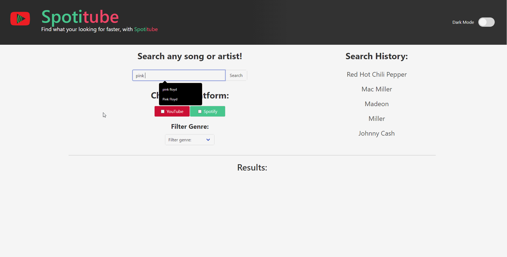

# Spotitube Web Application

This repository contains the source code for the Spotitube web application. Spotitube is a music and video search tool that allows users to search for music and videos on YouTube and Spotify. Users can filter their searches by genre and view the results on the same page.

## Table of Contents

- [Overview](#overview)
- [Features](#features)
- [Usage](#usage)
- [Notice](#notice)
- [Contributing](#contributing)
- [License](#license)

## Overview

The Spotitube web application is built using HTML, CSS (Bulma), and JavaScript. It leverages the YouTube Data API and Spotify API to search for music and videos based on user input. Users can select the platform they want to search on (YouTube or Spotify), enter a search query, and choose a genre filter. The application also keeps track of the user's search history.

## Features

- Search for music and videos on YouTube and Spotify.
- Filter search results by genre.
- View search history.
- Play YouTube videos within the application.
- Responsive design for various screen sizes.

## Usage

To use the Spotitube web application, simply visit the following deployed link:

[Spotitube Web Application](https://cyang0590.github.io/Multi-platform-music-search-engine/)

Follow these steps to use the application:

1. Open the provided link in your web browser.

2. Enter your search query in the search bar.

3. Select the platform (YouTube or Spotify) you want to search on by checking the respective checkbox.

4. Optionally, choose a genre filter from the dropdown menu.

5. Click the "Search" button.

6. View the search results in the respective sections:

- YouTube Results: Displays YouTube video search results.
- Spotify Results: Displays Spotify music search results.

To play a YouTube video, click on a video thumbnail in the YouTube Results section. This will open a modal with the video player.

To view your search history, check the "Search History" section on the right side of the page.

To close modals or error messages, click the "Close" button, press the escape key, or click anywhere outside of the modal.

### Screenshot

## Notice

There is a 100 query search limit for the YouTube API, so please try to be conservative with your requests. If the quota has been reached, an error will appear on the screen if you try to search with YouTube checked. 

This will happen, I promise it's not broken.
## License

This project is licensed under the MIT License. See the [LICENSE](LICENSE) file for details.